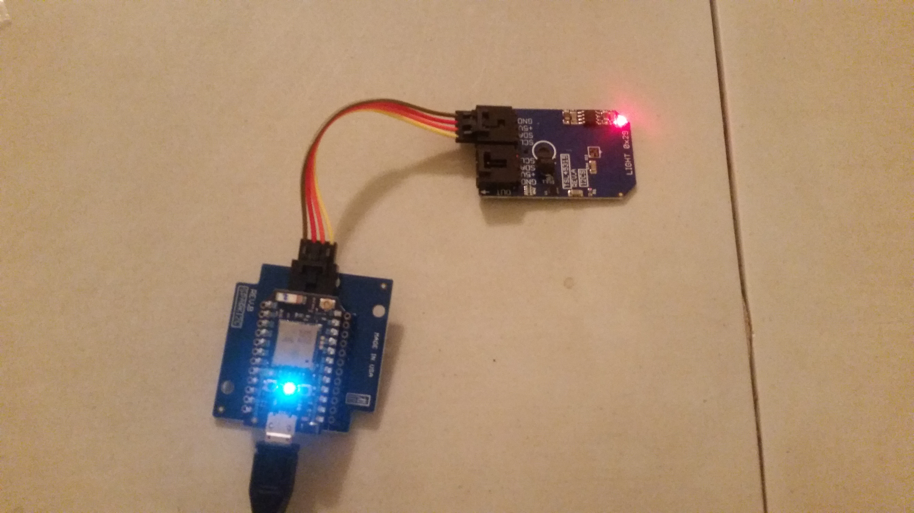

# Alto
Particle Photon + ADC121C021_PIZO Vibration Sensor



This sensor will monitor vibrations every second. It will send data to ChoralAllegro for processing. The json format is as follows:
```
{
    "device_id":"3df97c177d96280618348dbc7723d33870034e4e", //sha-1 hash of "vibration sensor"
    "user_secret":"secret",
    "data": {
        "vibration":"v1"
    },
    "timestamp":123456789
}
```

### Setup
