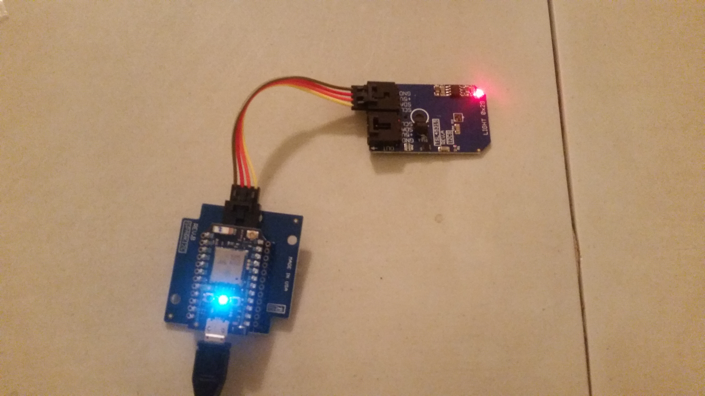

# Baritone
Particle Photon + MQ135 Air Quality Sensor



This sensor will monitor a room's air quality every second. It will send data to ChoralAllegro for processing. The json format is as follows:
```
{
    "device_id":"abef6fe4679519e33a0ee540de1c765ec0cb894f", //sha-1 hash of "air quality sensor"
    "user_secret":"secret",
    "data": {
        "ammonia":"am1",
        "alcohol":"al1",
        "nox":"n1",
        "benzene":"b1",
        "co2":"c1"
    },
    "timestamp":123456789
}
```

### Setup
