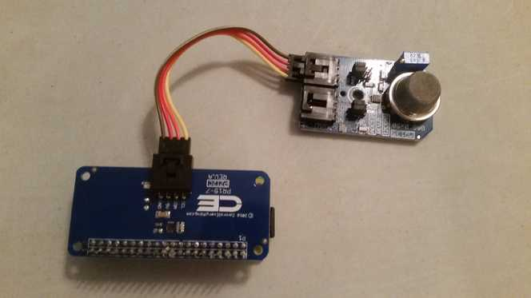

# Tenor
Raspberry Pi + TSL45315 Light Sensor



This sensor will monitor a room's luminance every second. It will send data to ChoralAllegro for processing. The json format is as follows:
```
{
    "device_id":"8ba5f37f7745f8e450b9a9f42534eb983099854a", //sha-1 hash of "light sensor"
    "user_secret":"secret",
    "data": {
        "luminance":"l1"
    },
    "timestamp":123456789
}
```

### Setup
1. Flash Raspberry Pi with Debian-lite
2. Follow this [raspberry pi zero guide]
3. `ssh pi@raspberrypi.local` with password `raspberry` and perform the below:
```
sudo apt-get update -y
sudo apt-get upgrade -y
sudo vim /boot/config.txt
    uncomment dtparam=i2c_arm=on
sudo raspi-config
    enable i2c
```
4. We will use Python and [smbus-cffi] to communicate between Rasberry Pi and sensor, so install dependencies
5. Download python file and place into `/home/pi/tenor/`
6. Run python file

[smbus-cffi]: https://pypi.python.org/pypi/smbus-cffi/0.5.1
[raspberry pi zero guide]: https://davidmaitland.me/2015/12/raspberry-pi-zero-headless-setup/